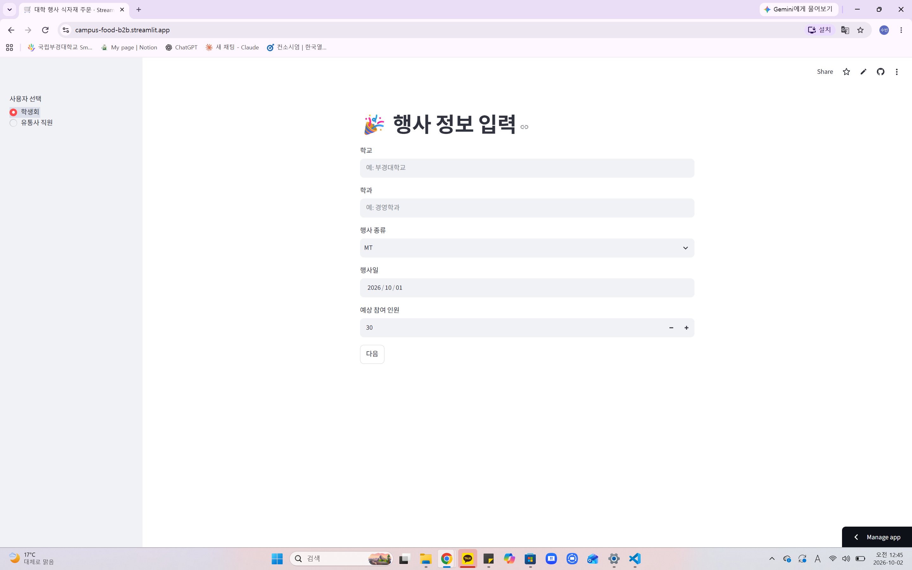
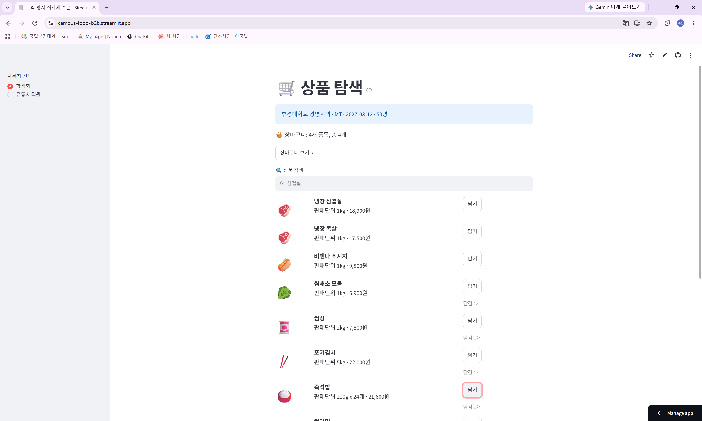
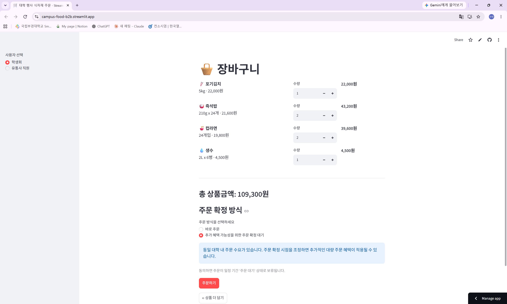
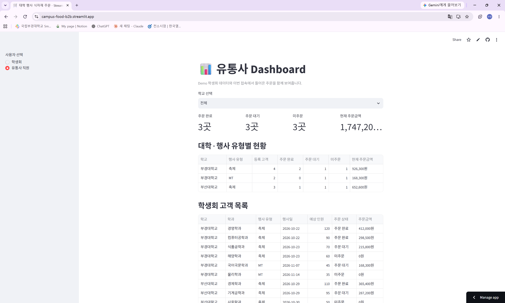

# campus-food-b2b
# 🛒 Campus Food B2B MVP

대학 학생회를 식자재 유통사의 새로운 B2B 고객으로 연결하고, 같은 대학에 흩어진 주문 수요를 유통사가 집계해 대량 주문으로 이어지게 하는 웹 서비스 MVP입니다.

**🔗 배포 링크: https://campus-food-b2b.streamlit.app/**

> 무료 호스팅 특성상 처음 접속 시 앱이 깨어나는 데 잠시 시간이 걸릴 수 있습니다.

---

## 1. 문제 정의

학생회 활동과 식자재 유통회사 인턴 경험에서 양쪽의 특성을 발견하고 기획했습니다.

**학생회 측**
MT·축제 준비로 식자재를 한 번에 많이 사지만, 기존 식자재 B2B 서비스는 꾸준히 구매하는 음식점·자영업자 중심입니다. 따라서 특정 행사를 위해 일시적으로 대량 구매하는 학생회에 맞는 구매 경험은 쿠팡뿐입니다.

**유통사 측**
학생회 하나의 주문은 작을 수 있습니다. 하지만 같은 대학의 여러 학생회가 비슷한 시기에 행사를 열기 때문에, 이 수요를 모으면 의미 있는 주문 규모가 됩니다. 이러한 대학교 학과들의 수요를 모아서 하나의 고객 코드를 개설 했을 때 유통사는 신규 고객으로 수용할 수 있습니다. 

## 2. 핵심 아이디어: 공동구매가 아닌 "공급자 측 수요 집계"

학생회끼리 공동구매를 조직하지 않습니다. 각 학생회는 독립된 고객으로 따로 주문하고, **유통사가 내부적으로 같은 대학·행사 유형의 주문을 집계**합니다. 주문 확정 시점을 조정할 의사가 있는 학생회는 "주문 확정 대기"를 선택해 추가 대량 주문 혜택을 받을 가능성을 얻습니다. 다른 학생회의 구체적인 주문 정보는 공개하지 않습니다.

## 3. 주요 기능

| 학생회 사용자 | 유통사 직원 |
|---|---|
| 행사정보 입력 (학교, 학과, 행사, 날짜, 인원) | 학교 선택 필터 |
| 상품 검색 및 장바구니 담기 | 주문 완료 / 대기 / 미주문 현황 |
| 수량 변경, 상품별·총 금액 계산 | 대학·행사 유형별 집계와 주문금액 |
| 바로 주문 / 주문 확정 대기 선택 | 학생회 고객 목록 |

### 화면

| 행사정보 입력 | 상품 탐색 |
|---|---|
|  |  |

| 장바구니 · 주문 방식 | 유통사 Dashboard |
|---|---|
|  |  |

### 시연 시나리오

1. 학교 `부경대학교`, 행사 `축제`로 아무 학과나 입력합니다.
2. 상품을 담고 **주문 확정 대기**로 주문합니다.
3. 왼쪽 사이드바에서 **유통사 직원**을 선택합니다.
4. 부경대학교 / 축제의 등록 고객과 주문 대기 수가 1씩 늘어난 것을 확인합니다.

## 4. 기술 스택과 선택 이유

- **Python + Streamlit**: 처음에는 HTML/CSS/JS로 GitHub Pages 배포를 계획했습니다. 하지만 웹 개발 입문자로서 제가 이해하고 설명할 수 있는 코드를 쓰는 것이 더 중요하다고 판단해, 유일하게 다룰 수 있는 언어인 Python 기반의 Streamlit으로 바꿨습니다.
- **Streamlit Community Cloud**: GitHub 저장소와 연결해 무료로 배포했습니다.
- **Git / GitHub**: 기능 단위로 커밋하며 개발 과정을 기록했습니다.

## 5. MVP 범위

**구현함**: 행사정보 입력, 상품 검색과 장바구니, 금액 계산, 주문 방식 선택과 상태 변경, 유통사 Dashboard

**구현하지 않음**: 회원가입·로그인, 실제 DB, 결제, 배송, 할인율 계산, AI 추천·수요예측

데이터는 코드 안에 둔 Demo 데이터와 세션 상태만 사용하므로, 새로고침하면 새로 들어온 주문은 초기화됩니다.

## 6. 데이터 원칙

인턴 회사의 실제 고객정보, 상품 공급가, 할인율, ERP 데이터 등 내부 정보는 일절 사용하지 않았습니다. 모든 상품, 가격, 학생회, 주문 데이터는 프로젝트를 위해 직접 만든 가상 데이터입니다.

## 7. 알고 있는 한계와 개선 방향

- 학교 이름을 직접 입력해서 "부경대"와 "부경대학교"가 따로 집계됩니다. → 학교를 '학교 찾기'목록에서 선택하도록 개선
- 같은 학생회가 추가 주문하면 고객이 중복으로 세어집니다. → 학생회별 고객 ID 도입
- 주문 대기 안내가 항상 표시됩니다. → 실제 동일 대학 수요가 있을 때만 표시
- 데이터가 저장되지 않습니다. → DB 연동 후 대학별·행사별 구매 패턴 분석으로 확장

## 8. 개발 과정

AI(Claude)와 함께 기획서를 작성한 뒤, 기능을 작은 Task로 나눠 하나씩 구현했습니다. 각 Task마다 성공 조건을 정하고 직접 테스트한 뒤 커밋했습니다.

## 9. 로컬 실행 방법

```
pip install -r requirements.txt
streamlit run app.py
```# campus-food-b2b